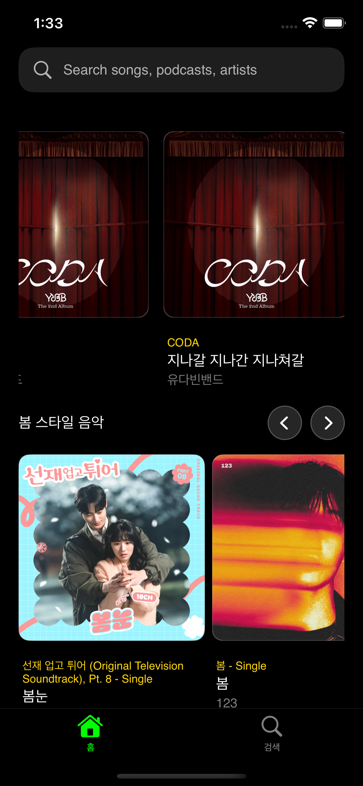
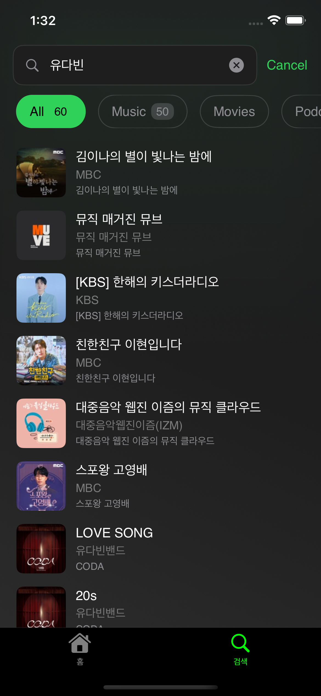

# MusicBandscape

Tuist로 구성된 멀티 모듈 iOS 프로젝트 템플릿입니다.

## 프로젝트 구조

```
MusicBandscape/
├── Workspace.swift
├── Tuist.swift
├── Projects/
│   ├── App/                  # 메인 애플리케이션
│   ├── Presentation/
│   │   └── Presentation/     # 화면 및 ViewModel 구성
│   ├── Core/
│   │   ├── Core/             # 핵심 공통 모듈
│   │   ├── Data/             # 데이터 계층 (Clean Architecture)
│   │   │   ├── API/          # REST API 클라이언트
│   │   │   ├── Model/        # 데이터 전송 객체 (DTO)
│   │   │   ├── Repository/   # Repository 구현체
│   │   │   ├── Service/      # 데이터 서비스
│   │   │   └── DataInterface/ # 🔥 Data → Domain 인터페이스
│   │   ├── Domain/           # 도메인 계층 (Clean Architecture)
│   │   │   ├── Entity/       # 도메인 엔티티 (비즈니스 모델)
│   │   │   ├── UseCase/      # 비즈니스 로직 구현체
│   │   │   └── DomainInterface/ # 🔥 Domain → Presentation 인터페이스
│   │   ├── Network/          # 네트워크 계층
│   │   │   └── Networking/   # 네트워크 기본 설정 및 클라이언트
│   │   └── ThirdParty/       # Core 레벨 외부 라이브러리
│   └── Shared/
│       ├── DesignSystem/     # 공통 UI 컴포넌트, 폰트 등
│       ├── Shared/           # 공통 공유 모듈
│       ├── ThirdParty/       # 외부 라이브러리 래핑
│       └── Utill/            # 공통 유틸리티
├── Tuist/
│   ├── Package.swift
│   └── ProjectDescriptionHelpers/
└── Plugins/
```

## 🚀 빠른 시작

### 새 프로젝트 생성 (권장)
#### Install tuist
 
```swift
curl -Ls https://install.tuist.io | bash 
```


```bash
# 1. TuistTool 컴파일 (최초 1회만)
swiftc TuistTool.swift -o tuisttool

# 2. 새 프로젝트 생성 (대화형으로 이름 설정)
./tuisttool newproject
```

### 템플릿 그대로 사용

```bash
tuist up          # 개발환경 부트스트랩
tuist install     # 라이브러리 다운로드
tuist generate    # 프로젝트 생성
tuist build       # 빌드
tuist test        # 테스트
```

## 주요 모듈 설명

### 📱 Application Layer
- **App**: 메인 애플리케이션 모듈 (앱 진입점 및 설정)
- **Presentation**: ViewController, ViewModel 등 UI 로직 담당

### 🏗 Core Layer (Clean Architecture)

#### Domain Layer (비즈니스 로직)
- **Domain**
  - **Entity**: 도메인 엔티티 및 비즈니스 모델 정의
  - **UseCase**: 비즈니스 로직 구현체 (실제 비즈니스 규칙)
  - **DomainInterface**: 🔥 **Domain → Presentation API** (UseCase 인터페이스)

#### Data Layer (데이터 처리)
- **Data**
  - **Repository**: Repository 패턴 구현체 (Domain Interface 구현)
  - **Model**: 데이터 전송 객체 (DTO, API Response/Request 모델)
  - **API**: REST API 클라이언트 및 Endpoint 정의
  - **Service**: 데이터 처리 서비스 (캐싱, 변환 등)
  - **DataInterface**: 🔥 **Data → Domain API** (Repository 인터페이스)
- **Network**: 네트워크 통신 계층
  - **Networking**: 네트워크 기본 설정 및 HTTP 클라이언트

#### Common Layer
- **Core**: 핵심 공통 기능 및 설정
- **ThirdParty**: 외부 라이브러리 (Core 레벨)

### 🎨 Shared Layer
- **DesignSystem**: 공통 UI 컴포넌트, 폰트, 색상 등 디자인 시스템
- **Shared**: 공통 공유 모듈 및 기본 설정
- **ThirdParty**: 외부 라이브러리 래핑 (TCA, WeaveDI, Alamofire 등)
- **Utill**: 날짜, 문자열, 로깅 등 공용 유틸리티

### 🔄 의존성 방향 (Clean Architecture)
```
Presentation → Domain/DomainInterface
Domain/UseCase → Data/DataInterface
Data/Repository implements DataInterface
```

### Tuist  graph


## 📸 구현 미리보기

| 홈 메인 | 검색 상세 |
| --- | --- |
|  |  |

> 스크린샷은 `Docs/Screenshots` 디렉터리에 저장되어 있으며, 최신 UI 상태에 맞춰 교체할 수 있습니다.


## 개발 환경

- iOS 16.0+
- Xcode 15.0+
- Swift 5.9+
- Tuist 4.50+

## 사용 라이브러리

- **ComposableArchitecture**: 상태 관리
- **TCACoordinators**: 화면 전환 관리
- **WeaveDI**: 의존성 주입
- **SwiftLint**: 코드 스타일 체크

## 설계 및 의사결정 기록

### 모듈화 & Clean Architecture
- Domain/Data/Presentation을 독립 모듈로 분리하여 의존성 역전과 테스트 용이성을 확보했습니다.
- 각 레이어는 Protocol 기반 인터페이스로만 연결하여 구현체 교체가 자유롭습니다.

### 상태 관리: Composable Architecture
- 비동기 작업과 사이드이펙트를 Reducer/Effect로 통일해 화면 간 일관된 패턴을 유지했습니다.
- TestStore 기반 단위 테스트를 통해 onAppear, 검색, 탭 전환 등 주요 시나리오를 검증합니다.

### 네트워킹 & 데이터 흐름
- `AsyncMoya` 조합으로 iTunes API를 호출하고, DTO → Domain 매핑을 통해 Presentation 의존성을 최소화했습니다.
- Repository는 DomainInterface를 구현하며, 테스트에서는 Mock Repository로 교체해 빠른 회귀 검증이 가능합니다.

### 의존성 주입: WeaveDI
- KeyPath 기반 등록으로 모듈 간 결합도를 낮추고, 테스트 환경에서 Mock을 손쉽게 주입할 수 있게 했습니다.
- Shared 모듈의 `@AutoSyncExtension`을 통해 TCA Environment와 DI 컨테이너를 자연스럽게 연결했습니다.

### UI & 내비게이션 전략
- `TCACoordinators`로 루트 탭과 상세 화면 전환을 구성하여 화면 상태를 명확히 추적합니다.
- `Shared/DesignSystem`에서 공통 UI 자산을 관리해 피처 모듈이 비즈니스 로직에 집중하도록 했습니다.

## 추가 구현 사항

- **계절별 자동 로딩**: 홈 진입 시 5개의 시즌 곡을 병렬로 가져와 최신 순 정렬 후 중복 제거.
- **검색 카테고리 통계**: 전체/음악/영화/팟캐스트/기타 탭별 결과 수를 실시간 표시.
- **최근/추천 검색 흐름**: 최근 검색어 관리 및 Trending 항목을 통해 원탭 재검색 지원.
- **상세 공유 상태**: 홈과 검색에서 선택한 곡을 Shared Storage로 보존해 Detail 화면에서 즉시 활용.
- **테스트 강화**: Reducer 테스트로 에러 처리, 정렬, 카운트 로직 등을 회귀 검증.

## 메모리 관리 분석

- **도구**: Xcode Instruments의 *Leaks*와 *Allocations*를 활용했습니다.
- **점검 절차**
  1. 홈 → 검색 → 상세 → 뒤로 이동 흐름을 반복 실행하면서 Allocations 그래프를 확인했습니다.
  2. Reducer/UseCase/Repository 인스턴스의 Retain Count가 화면 이탈 후 안정적으로 감소하는지 체크했습니다.
  3. Leaks 세션을 녹화하여 비동기 `Effect.run` 및 DI 등록부에서 순환 참조가 발생하지 않는지 조사했습니다.
- **결과**
  - 누수 및 순환 참조가 검출되지 않았습니다. Reducer 내부 비동기 작업은 `await send` 후 종료되어 self 캡처를 남기지 않습니다.
  - Repository/UseCase는 값 타입 또는 단순 클래스이므로 추가적인 `weak` 처리 없이도 회수되었습니다.
- **향후 가이드**
  - 새 피처 추가 시 Instruments 세션을 재실행해 메모리 안정성을 주기적으로 확인하는 것을 권장합니다.

## 🏗 Clean Architecture 설계

### 🎯 인터페이스 분리 설계

이 프로젝트는 **계층별 인터페이스 분리**를 통해 Clean Architecture를 구현합니다:

```swift
// Domain이 Presentation에게 제공하는 API
// Domain/DomainInterface/UserUseCaseInterface.swift
protocol UserUseCaseInterface {
    func getUser(id: String) async throws -> User
    func updateUserProfile(_ user: User) async throws
}

// Data가 Domain에게 제공하는 API
// Data/DataInterface/UserRepositoryInterface.swift
protocol UserRepositoryInterface {
    func fetchUser(id: String) async throws -> UserDTO
    func saveUser(_ user: UserDTO) async throws
}
```

### 💡 이점

#### 1. **의존성 역전 (Dependency Inversion)**
```swift
// Domain/UseCase/UserUseCase.swift
final class UserUseCase: UserUseCaseInterface {
    private let repository: UserRepositoryInterface  // 인터페이스에 의존

    init(repository: UserRepositoryInterface) {
        self.repository = repository
    }
}
```

#### 2. **테스트 용이성**
```swift
// 테스트에서 Mock 객체 쉽게 생성
final class MockUserRepository: UserRepositoryInterface {
    func fetchUser(id: String) async throws -> UserDTO {
        return UserDTO(id: "test", name: "Test User")
    }
}
```

#### 3. **모듈 간 결합도 감소**
- UseCase는 Repository **구현체**를 모름
- **인터페이스**만 알면 되므로 변경에 유연함

#### 4. **의존성 주입 (WeaveDI) 활용**
```swift
// WeaveDI를 사용한 의존성 등록
let userRepository = UnifiedDI.register(UserRepositoryInterface.self) {
    UserRepository()
}

let userUseCase = UnifiedDI.register(UserUseCaseInterface.self) {
    UserUseCase(repository: UnifiedDI.resolve(UserRepositoryInterface.self))
}

// Property Wrapper를 사용한 주입 (권장)
final class UserViewController: UIViewController {
    @Injected(\.userUseCase) private var userUseCase: UserUseCaseInterface

    override func viewDidLoad() {
        super.viewDidLoad()
        // userUseCase 자동 주입됨
    }
}

// KeyPath 기반 등록 (TCA 스타일)
let userUseCase = UnifiedDI.register(\.userUseCase) {
    UserUseCase(repository: UnifiedDI.resolve(UserRepositoryInterface.self))
}
```

---

# 🛠️ TuistTool (커스텀 CLI)

프로젝트 전용 CLI 도구입니다. Tuist 명령을 래핑하고, 새 프로젝트 생성, 모듈 스캐폴딩 등을 지원합니다.

## 설치 및 사용법

```bash
# 컴파일
swiftc TuistTool.swift -o tuisttool

# 사용법
./tuisttool <command>
```

### 지원 명령어 요약

| Command       | 설명 |
|---------------|------|
| `newproject`  | **🚀 새 프로젝트 생성**: 프로젝트 이름을 동적으로 설정하여 새로운 프로젝트를 생성. 대화형 입력 또는 명령어 인자 지원. |
| `generate`    | `tuist generate` 실행. 내부적으로 `TUIST_ROOT_DIR` 환경변수를 현재 디렉토리로 설정합니다. |
| `fetch`       | `tuist fetch` 실행(SPM/패키지 재해석). |
| `build`       | **clean → fetch → generate** 순서로 실행(빠른 클린 빌드 워크플로우). |
| `clean`       | `tuist clean` 실행(Tuist 캐시/생성물 정리). |
| `edit`        | `tuist edit` 실행(Project.swift 편집용 Xcode 프로젝트 생성). |
| `install`     | `tuist install` 실행(프로젝트 정의에 필요한 플러그인/템플릿 설치). |
| `cache`       | `tuist cache DDDAttendance` 실행(지정 타깃을 프리빌드 캐시). 필요 시 대상 타깃으로 수정하세요. |
| `reset`       | **강력 클린**: Tuist 캐시, Xcode DerivedData, `.tuist`, `.build` 폴더 삭제 후 `fetch → generate` 재실행. |
| `moduleinit`  | **모듈 스캐폴딩 마법사**: 모듈 이름/의존성 입력을 받아 `tuist scaffold Module` 실행 및 `Project.swift`에 의존성 자동 삽입. Domain 모듈일 경우 Interface 폴더/템플릿 생성 옵션 제공. |

### 상세 동작

- **newproject**
  - 환경변수 `PROJECT_NAME`, `BUNDLE_ID_PREFIX`, `TEAM_ID`를 설정하고 `tuist generate`를 실행합니다.
  - 대화형 모드: 프로젝트 이름, 번들 ID 접두사, 팀 ID를 순차적으로 입력받습니다.
  - 명령어 인자 모드: `--name`, `--bundle-id`, `--team-id` 옵션으로 바로 설정 가능합니다.
  - 생성 완료 후 자동으로 Xcode 실행 옵션을 제공합니다.
- **generate**
  - `TUIST_ROOT_DIR`를 현재 경로로 설정 후 `tuist generate` 수행.
- **build**
  - 내부적으로 `clean → fetch → generate` 호출. CI 로컬 재현에 유용.
- **reset**
  - 아래 경로를 삭제합니다.
    - `~/Library/Caches/Tuist`
    - `~/Library/Developer/Xcode/DerivedData`
    - 프로젝트 루트의 `.tuist`, `.build`
  - 이후 `fetch`, `generate`를 순차 실행.
- **moduleinit**
  - `Plugins/DependencyPlugin/ProjectDescriptionHelpers/TargetDependency+Module/Modules.swift`에서 **모듈 타입** 및 **케이스 목록**을 파싱합니다.
  - `Plugins/DependencyPackagePlugin/ProjectDescriptionHelpers/DependencyPackage/Extension+TargetDependencySPM.swift`에서 **SPM 의존성 목록**을 파싱합니다.
  - 입력 받은 의존성들을 `Projects/<Layer>/<ModuleName>/Project.swift`의 `dependencies: [` 영역에 자동 삽입합니다.
  - Domain 계층 생성 시, `Interface/Sources/Base.swift`를 템플릿으로 생성하도록 선택 가능.

